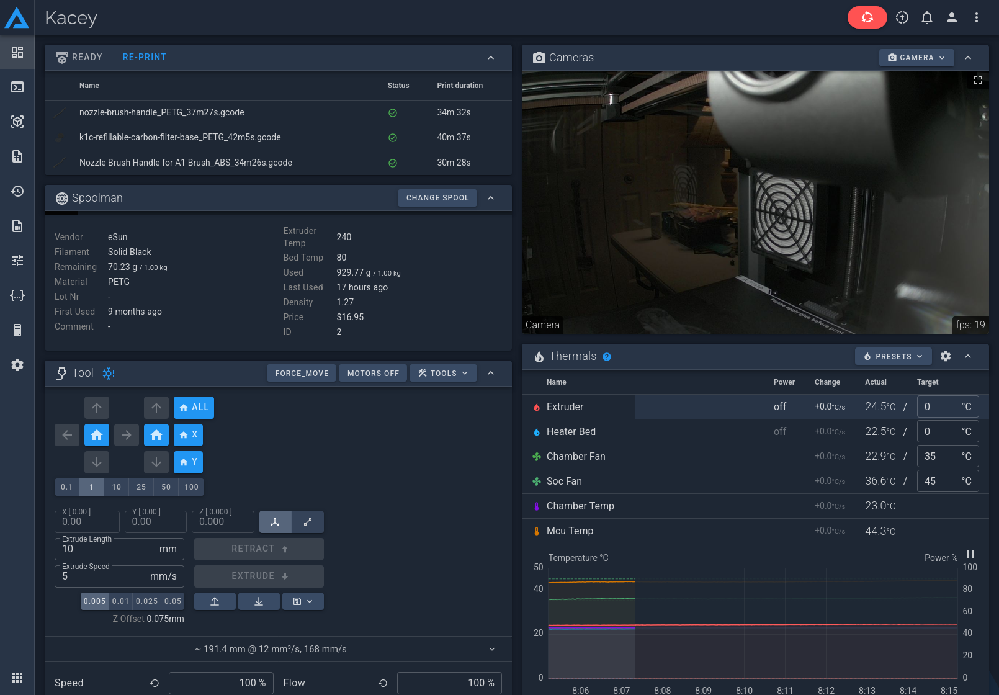
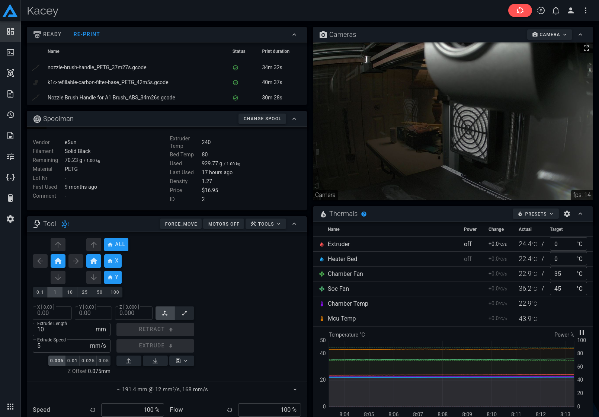

<p align=center>

</p>
<p>
    <h1 align=center>Fluidd Custom CSS</h1>
</p>

I have never liked the brownish-grey dark theme for the Fluidd UI, so I decided to create my own with custom CSS. So far, I have created two themes, "Dark Blue" and "Modern Dark". The "Dark Blue" theme is based on Google's "Material You" style, and shades the UI elements with varying shades of navy blue. The "Modern Dark" theme uses shades of black and grey based on GitHub's default dark theme which is one of my favorite. 

Unlike the community theme presets, these themes go beyond changing the accent color and logo in the upper left corner. These CSS themes actually don't even touch that. You can still select your desired community theme and accent color as you normally do. These themes change the colors of the UI elements themselves, and they only affect the dark mode. The light theme will still work as normal _(except for the code editor)_. Let me know if you would like to see some light themes too... Maybe that is something I can work on. I don't personally use light themes, so it is not what I focused on. 





## Clone the Repo

``` bash
git clone https://github.com/benhaube/fluidd-custom-css.git
cd fluidd-custom-css/
```

## Install & Activate

To activate the theme you need to create the directory, `.fluidd-theme`, in your printer's configuration directory, then add the theme file, `custom.css`. After that you can refresh and clear cache _(`Ctrl+F5`)_, and Fluidd will detect the `custom.css` file and apply the changes automatically. 

> [!tip]
> On my **Creality K1C** the configuration directory is located at `/usr/data/printer_data/config`, but check the documentation for your own printer because it may be different. 

### Method 1 _(SSH)_

1. Gain SSH access to your 3D-printer.
2. Create the `.fluidd-theme` directory: 

    ``` bash
    mkdir -p /usr/data/printer-data/config/.fluidd-theme
    ```

3. Back on your computer's terminal, use the `scp` command to copy the `custom.css` file onto your 3D-Printer:
   
    ``` bash
    scp theme_name/custom.css root@<printer-ip>:/usr/data/printer-data/config/.fluidd-theme
    ```

4. Refresh your browser and clear cache with `Ctrl+F5`.

### Method 2 _(Fluidd UI)_

1. Log into the Fluidd web-UI in your browser.
2. Navigate to the **Configuration** tab.
3. Click the **`+`** icon at the top of the file browser, then click **Add Directory**. 
4. Name the new directory `.fluidd-theme`. 
5. Enter the new directory, then drag & drop the file `custom.css` into the file manager to upload it to the printer. 
6. Refresh your browser and clear cache with `Ctrl+F5`.

## Known Issues

- The code editor keeps the dark theme when using the light theme.
- The code lens and mini-map background keeps the background color of the regular Fluidd dark theme. _(If you know how to fix this let me know. I have not been able to find the correct properties/rules.)_